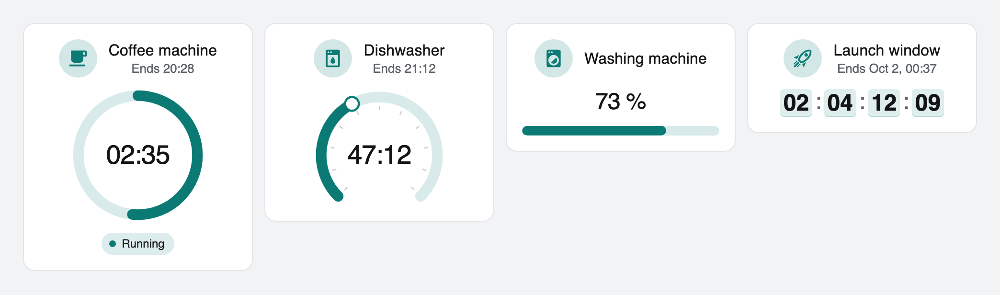
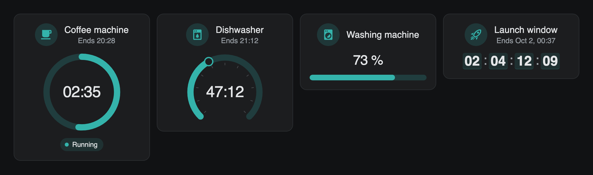
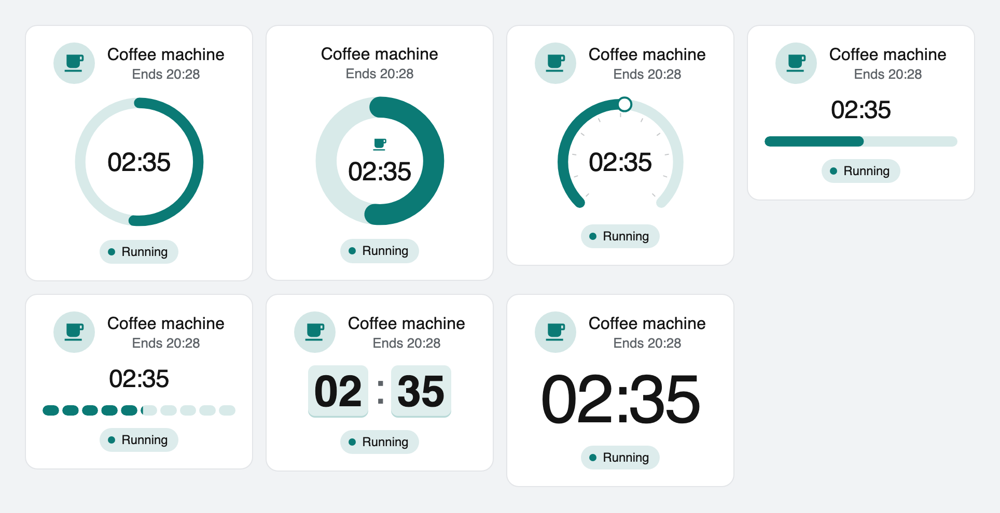
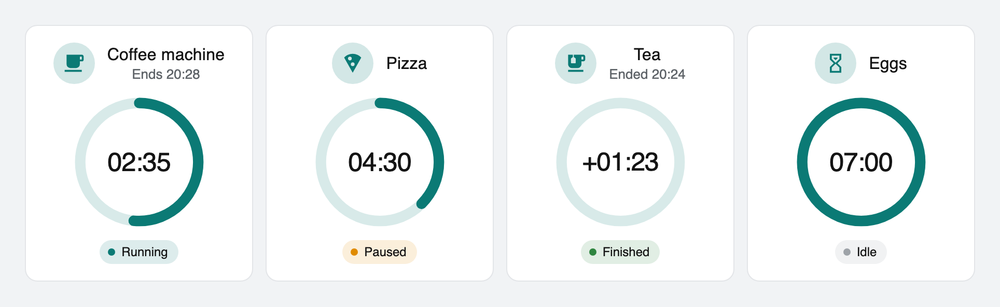
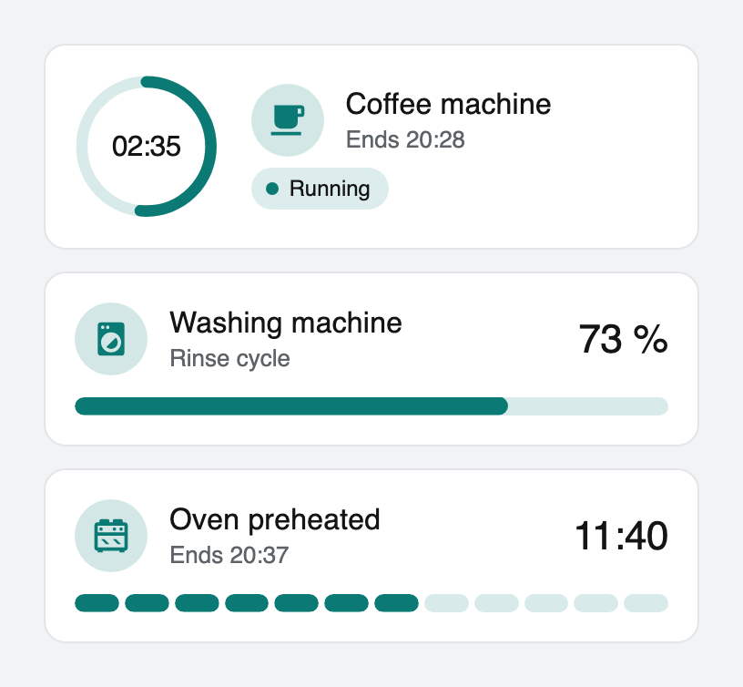
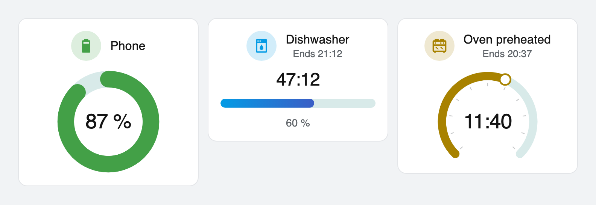
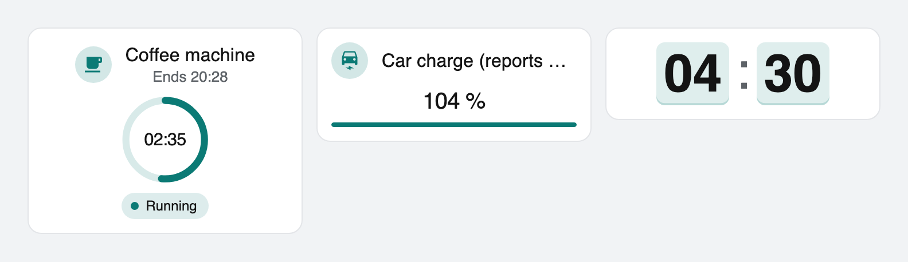
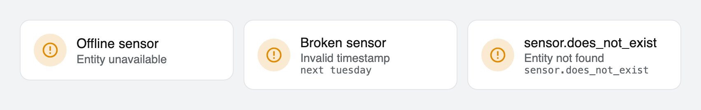

# Advanced Countdown Card

A Lovelace card for Home Assistant that shows how much is left: of a timer, of
the time until a timestamp, or of a value on a scale. As a ring, a gauge, a
bar, segments, digital tiles or just the number.

[](https://github.com/julezdean/lovelace-advanced-countdown-card/actions/workflows/ci.yml)
[](https://github.com/hacs/integration)
[](https://github.com/julezdean/lovelace-advanced-countdown-card/releases)

[](https://my.home-assistant.io/redirect/hacs_repository/?owner=julezdean&repository=lovelace-advanced-countdown-card&category=plugin)





`display.type` -- the same running timer as circle, donut with the icon inside,
gauge, bar, segments, digital and number:



A timer running, paused, finished (counting up since it ended) and idle:



| `layout: horizontal` | Thresholds, a two-colour bar, a gradient over the course |
|---|---|
|  |  |

Compact and minimal, and what the card does with bad data:





---

## Installation

### HACS

The badge above opens this repository straight in your own Home Assistant.
By hand:

1. HACS → ⋮ → **Custom repositories**
2. Add this repository, type **Dashboard**. (HACS still calls the category
   `plugin` on the wire; "Lovelace" and "Plugin" are the older names for the
   same thing.)
3. Install **Advanced Countdown Card**
4. HACS offers to add the Lovelace resource. If it does not, add it manually
   (below).

### Manual

1. Download `advanced-countdown-card.js` from the
   [latest release](../../releases/latest) -- or build it yourself:

   ```
   npm ci && npm run build
   ```

2. Copy it to `config/www/advanced-countdown-card.js`.

3. Add the Lovelace resource: **Settings → Dashboards → ⋮ → Resources → Add**

   | Field | Value |
   |---|---|
   | URL | `/local/advanced-countdown-card.js?v=0.1.0` |
   | Type | **JavaScript Module** |

   The `?v=` is not decoration: `/local/` is served with a one-month
   `Cache-Control`, so a new file behind an unchanged URL is simply not
   fetched. Bump it on every deploy -- by editing the entry, not by adding a
   second one. See *Troubleshooting*.

4. Reload the browser.

### Requirements

| | |
|---|---|
| Home Assistant | **2024.4.0 or newer** |
| Finished vs. cancelled timers | **2026.5.0 or newer** -- see below |

---

## Configuration

Minimal -- everything else has a default and the card detects what the entity
holds:

```yaml
type: custom:advanced-countdown-card
entity: timer.coffee
```

A visual editor is available in the card picker. It covers everything except
thresholds, status labels, value maps and entity-based start times, which are
lists and mappings a form would only make worse.

More examples in [`examples/`](examples/): a timer, a timestamp, a percentage, a
template, a wall-tablet grid and one with nearly every option. Every example is
checked by the test suite, so none of them is out of date.

### Sources

```yaml
source:
  type: auto        # auto | timer | timestamp | percentage | numeric |
                    # state | attribute | template
  attribute: …      # read this attribute instead of the state
  map: { … }        # state -> number or timestamp, before interpretation
  template: …       # for type: template
  naive_timezone: server   # server | browser
```

| `type` | Reads | Progress |
|---|---|---|
| `timer` | A `timer.*` entity: `finishes_at`, `duration`, `remaining`, state | from `duration` |
| `timestamp` | An ISO 8601 date-time, a date, or a time of day, from the state or `attribute` | only with `progress.start` or `progress.window` |
| `percentage` | A number, 0–100 unless `progress.min/max` say otherwise. `73` and `73%` both work. | the value |
| `numeric` | A number; the range comes from `progress.min/max`, else from the entity's own `min/max` (input_number, number) or `minimum/maximum` (counter), else 0–100 | the value |
| `state` / `attribute` | One value, interpreted as a timestamp or a number by what it is | as above |
| `template` | Whatever Home Assistant renders -- see *Templates* | as above |
| `auto` | Picks one of the above from the entity | |

`auto` decides in this order: a `timer.*` entity is a timer; `device_class:
timestamp` or `date`, or an `input_datetime`, is a timestamp; a `%` unit or
`device_class: battery/humidity/moisture` is a percentage; a state that is an
ISO date-time is a timestamp; any other number is numeric. If none fits the
card says so instead of guessing.

`map` turns states into something measurable -- a washing machine that reports
its programme stage rather than a percentage:

```yaml
entity: sensor.washer_stage
source:
  type: numeric
  map: { wash: 30, rinse: 70, spin: 90 }
```

### Progress

```yaml
progress:
  direction: remaining   # remaining (100 → 0 %) | elapsed (0 → 100 %)
  start: …               # ISO time | last_changed | { entity, attribute }
  end: …                 # overrides the end the source read
  window: 24h            # start = end - window. "90m", "1d 2h", seconds
  min: 0                 # numeric range
  max: 100
```

A timestamp says when something ends, not when it started. Without a `start`
or a `window` the card still counts down, but draws the ring full and muted:
it has nothing to measure the proportion against, and it does not make one up.
`last_changed` is offered as a start but not used by default, because it resets
on every Home Assistant restart.

`direction` applies to countdowns. A value is always drawn as itself.

### Display

```yaml
display:
  type: circle      # circle | radial | bar | segments | digital | numeric
  inner: value      # circle/radial: value | percentage | icon | none
  style: ring       # circle: ring | donut. bar: default | thin
  thickness: 8      # circle/radial: % of the diameter. bar/segments: px
  size: medium      # small | medium | large
  orientation: horizontal   # bar/segments: horizontal | vertical
  segments: 12
  arc: 270          # radial: opening in degrees, 90–340
  rounded: true
  track: true
  gradient: false   # colour runs from colors.primary to colors.secondary
```

Shorthand: `display: bar`.

`segments` fills the segment the progress is in partially, so a 12-segment
countdown over an hour does not sit still for five minutes at a time.

### Countdown format

```yaml
format:
  style: auto       # auto | SS | MM:SS | HH:MM:SS | DD:HH:MM:SS | short | long
  largest_units: 2  # short/long: how many units, "2h 34m" = 2
  show_days: auto   # auto | true | false, likewise show_hours/minutes/seconds
  decimals: 0       # for values and percentages
```

| `style` | 2 h 34 min 17 s | 2 d 4 h 12 min |
|---|---|---|
| `auto` | `02:34:17` | `2d 04h 12m` |
| `HH:MM:SS` | `02:34:17` | `52:12:00` |
| `short` | `2h 35m` | `2d 05h` |
| `long` | `2 hours, 35 minutes` | `2 days, 5 hours` (in the dashboard's language) |

Under an hour, `auto` is `MM:SS`. The largest unit of a fixed pattern absorbs
everything above it (`MM:SS` shows 2 hours as `120:00`).

**A countdown rounds up** to the last unit it shows: with 0.4 s left it reads
`00:01`, and `00:00` appears exactly when the time is up. That is how every
kitchen timer works; rounding down would show `00:00` for the whole last second
while the timer is still running. Time counted up after the end rounds down for
the same reason.

### Colours

```yaml
colors:
  primary: "#03A9F4"   # or a theme colour name (red, amber, …) or var(--x)
  secondary: …         # the other end of display.gradient
  track: …
  text: …
  mode: static         # static | thresholds | gradient
  basis: progress      # thresholds compare: progress | remaining_seconds | value
  thresholds:
    - { value: 75, color: "#4CAF50" }
    - { value: 40, color: "#FFC107" }
    - { value: 0, color: "#F44336" }
  start: "#4CAF50"     # gradient: colour at the start of the course
  end: "#F44336"       # gradient: colour at the end
```

Without colours the card follows the theme's `--primary-color`. The track,
the icon badge and the digit tiles are derived from the progress colour, so a
threshold colours the whole card consistently.

**Thresholds** pick the highest one the metric reaches; below the lowest, the
lowest applies. `basis: remaining_seconds` is the one for "the last minute in
red":

```yaml
colors:
  mode: thresholds
  basis: remaining_seconds
  thresholds:
    - { value: 60, color: green }
    - { value: 0, color: red }
```

**Gradients** run over the course -- start colour when the countdown begins,
end colour when it ends, whichever way `direction` draws it. They mix in OKLCH
rather than sRGB: green to red passes through yellow instead of brown.

### Animation

```yaml
animation:
  enabled: true
  progress: smooth      # smooth | tick | none
  effect: none          # none | pulse | glow | breathing | rotate
  effect_when: active   # always | active | finishing | finished
  finishing_seconds: 60
  digits: none          # none | flip | fade -- digital and numeric only
  speed: normal         # slow | normal | fast
```

`smooth` interpolates between ticks, so a ring moves continuously; `tick` steps
once a second. `rotate` spins the icon. The effects are deliberately small --
ten cards pulsing at full strength on a wall tablet are a light show.

**`prefers-reduced-motion: reduce` switches every animation and transition off**
-- not slower, off. The values still update.

### When it is over

```yaml
on_complete:
  action: show_zero   # show_zero | show_text | hide | count_up
  text: Done          # for show_text; default is "Finished" in your language
  color: green        # progress colour once finished
  effect: glow        # an effect for the finished state
```

`count_up` shows the time since the end as `+01:23`. `hide` hides the card and
frees its place in a sections view; in the card editor's preview it stays
visible, dimmed.

Shorthand: `on_complete: count_up`.

### Status, icon, text

```yaml
status:
  show: auto          # auto (timers and templates) | true | false
  labels: { active: Läuft, paused: Pause, idle: Bereit, finished: Fertig }

icon:
  icon: auto          # auto (the entity's) | mdi:… | false
  position: left      # left | top | inner (inside the ring)
  size: 1             # relative
  color: auto         # auto follows the progress colour

text:
  title: auto         # auto = the entity name
  subtitle: auto      # auto = "Ends 20:28" for a countdown
  value: auto         # the countdown or the value
  percentage: false   # true shows it; also takes a text
```

Every text area takes `auto`, `false` to hide it, or a text with placeholders:

`{name}` `{state}` `{value}` `{remaining}` `{percentage}` `{status}` `{unit}`
`{end_time}` `{end_date}` `{attr:some_attribute}`

```yaml
text:
  title: "{name} · {attr:program}"
  subtitle: "ready at {end_time}"
```

An unknown placeholder stays as written, so a typo shows up on the card
instead of vanishing. This is deliberately not a template language -- for
logic, use `source.type: template`.

Times follow the Home Assistant profile: 12/24 hours and server or browser
time zone.

### Layout and appearance

```yaml
layout:
  orientation: vertical   # vertical | horizontal
  density: normal         # normal | compact | minimal
  align: center           # center | start

appearance:
  glass: false            # backdrop-filter; needs a view background image
  background: …           # card background
```

Shorthand: `layout: horizontal`.

The layout responds to the card's own width through container queries, not to
the screen: a card that is narrow in a grid cell on a wide monitor lays out as
narrow. In a sections view it asks for half a section (6 columns), a
horizontal card for a whole one.

### Actions

```yaml
tap_action:
  action: more-info   # the default
hold_action:
  action: perform-action
  perform_action: timer.cancel
  target: { entity_id: timer.coffee }
  confirmation:
    text: Cancel the timer?
double_tap_action:
  action: none
```

The card does not run actions itself. It hands them to Home Assistant's own
action handler (the `hass-action` event, in the frontend since June 2023), so
every action and option works exactly as on a built-in card -- including
`confirmation`, `assist` and `navigate`. A plain tap fires without delay; the
250 ms double-tap wait only exists when a `double_tap_action` is configured.

With any action the card is focusable and responds to Enter and Space.

---

## How the countdown works

Home Assistant is asked for nothing while a countdown runs.

1. **On an entity change** the card reads a *snapshot*: the end time, the start
   time or duration, a frozen remaining time for a paused timer. It holds no
   "now", so it stays valid until the entity changes again. `hass` is replaced
   on every state change in the whole installation; the card compares only the
   entities it actually reads and ignores everything else.
2. **Once a second** a shared ticker hands every running card the current time,
   and the card computes what to show. One timer serves every card on the
   page, and it only exists while at least one countdown runs.
3. **Only a visible change renders.** A tick re-renders the card only if a
   text changed or the drawing moved by at least 0.1 % -- below a pixel on any
   ring a dashboard draws. A 2-hour countdown as `2h 34m` on a bar renders
   about every 7 seconds; as plain `numeric` text, once a minute. A paused
   timer, an idle one, a percentage: no ticking at all.

Two details make it exact rather than approximately right:

- **Each card ticks at its own millisecond.** A timer's `finishes_at` is not on
  a whole second (Home Assistant writes microseconds), so the digits of a timer
  ending at `.600` have to change at `.600` every second. Ticking on the wall
  clock's second would show every value up to a second too long, including
  `00:00` arriving late.
- **Hidden tabs do not tick.** When the tab becomes visible again the card
  recomputes at once, so it never shows a stale value.

### Timers

Home Assistant's timer writes its state only on transitions. While a timer
runs, `remaining` still holds the value from when it started; the live
countdown has to come from `finishes_at`, which is also what Home Assistant's
own frontend does.

| Timer | Card |
|---|---|
| `active` | counts down to `finishes_at`; progress from `duration` |
| `paused` | shows the frozen `remaining`, does not tick |
| `idle` | shows `duration`, progress full (or empty for `elapsed`) |
| `idle` + `last_transition: finished` | **finished** -- `on_complete` applies, `count_up` counts from the moment it ended |

The last row needs Home Assistant **2026.5** or newer, which added
`last_transition`. On older versions a finished timer and a cancelled one look
the same once idle, and the card shows both as idle. It still shows
*finished* for the moment between reaching zero in the browser and Home
Assistant reporting idle.

The card cannot subscribe to the `timer.finished` event instead: non-admin
users may only subscribe to the events in Home Assistant's
`SUBSCRIBE_ALLOWLIST`, and it is not one of them.

### Templates

```yaml
source:
  type: template
  template: "{{ states('sensor.dishwasher_end') }}"
```

The template is rendered **by Home Assistant**, over the `render_template`
websocket subscription -- the same mechanism the markdown card uses. Home
Assistant tracks which entities the template reads and pushes a new result when
one changes; the card never polls and never re-sends it. `render_template` has
no admin requirement, so this works for every user.

`entity` inside the template is the card's own entity. The result may be:

- a **timestamp** -> a countdown
- a **number** -> a value on `progress.min`..`max`
- a **mapping** for more than one number:

  ```jinja
  {{ {'start': states('sensor.start'), 'end': states('sensor.end'), 'name': 'Bread'} }}
  ```

  Keys: `end`, `start`, `duration`, `value`, `min`, `max`, `status`
  (`active`/`paused`/`idle`/`finished`), `remaining` (for paused), `name`.

A syntax error or a rendering error is shown in the card with Home Assistant's
message. JavaScript in the config is deliberately not supported: it would be a
second template language with none of the first one's knowledge of your
entities.

---

## Accessibility

- The card carries an `aria-label` with title, value, status and percentage.
- A live region announces status changes -- started, paused, finished -- and
  nothing else. Announcing every second would make a screen reader unusable.
- With an action, the card is a button: focusable, Enter and Space tap.
- Nothing is said by colour alone: the status chip has a text, a threshold
  colour always sits next to the number it colours.
- `prefers-reduced-motion` switches all motion off.

---

## Known limitations

- **The browser's clock is trusted.** The countdown compares `finishes_at`
  with the clock of the device showing the dashboard. A tablet whose clock is
  20 seconds off shows a countdown that is 20 seconds off. Home Assistant's own
  timer display has the same property. Estimating the offset from state
  timestamps was considered and left out: network delay and throttled tabs
  make the estimate noisy, and a wrong correction is worse than none.
- **Finished vs. cancelled needs 2026.5** -- see *Timers*.
- **The visual editor is only tested against a stand-in for `ha-form`.** The
  test suite copies `ha-form`'s binding rule and round-trips every field, but
  Home Assistant's real `ha-form` has not run against this schema. If
  `ha-form` is not loaded when the editor opens, the card loads it through the
  card helpers -- a workaround most custom cards use that relies on frontend
  internals. The YAML editor works regardless.
- **Colour mixing uses CSS `color-mix()`** (gradients, the track, the icon
  badge). It is supported by current Chrome, Safari and Firefox; how the card
  looks in a browser without it has not been tested.

---

## Troubleshooting

**The card shows "Entity not found".** The id in `entity` does not exist.
Check it in Developer Tools → States. The id is shown under the message.

**"Cannot tell what this entity holds".** `source.type: auto` found neither a
timer, a timestamp nor a number. Set `source.type` and, if the value is an
attribute, `source.attribute`. The offending state is shown under the message.

**A timestamp is off by a few hours.** It has no offset and is read in the
Home Assistant server's time zone. If it was written in the browser's zone,
set `source.naive_timezone: browser`.

**The ring is full and pale.** A timestamp without a start -- see *Progress*.

**Nothing appears / "Custom element doesn't exist".** The resource is not
loaded. Check the URL under Settings → Dashboards → Resources, then reload.

**The card does not update after I copy a new file.** `/local/` is served with
`Cache-Control: public, max-age=2678400` -- one month. The browser does not
ask whether the file changed. Change the URL (`?v=0.1.1`), not the file. HACS
does this by itself, which is why the problem never appears on a HACS install.
The card logs its version to the browser console on load; that is how to check
which file is actually live.

**Two resource entries are worse than a stale cache.** A second entry for the
same file loads it twice, and whichever copy loads first wins -- an update
then silently does nothing. The card says so in the console:

```
[advanced-countdown-card] is already registered, so this copy does nothing.
```

**I want to see what the card read.** `debug: true` logs every snapshot and
view model to the browser console.

---

## Development

```
npm ci
npm run build      # typecheck + single-file bundle into dist/
npm test           # vitest
npm run check      # format, lint, types, tests, build -- what CI runs
npm run watch      # rebuild on change
```

The demo gallery with mock Home Assistant data, including the failure states,
runs on a live clock:

```
npm run build && python3 -m http.server 4173
```

then open <http://localhost:4173/demo/>. Actions are logged at the bottom of
the page instead of being run.

Screenshots are regenerated with `./scripts/screenshots.sh`; the recipe and the
sizes are documented in [`docs/screenshots.md`](docs/screenshots.md).

### Architecture

```
src/
  main.ts                 entry point, card picker registration
  const.ts                tag, version, repository, timings
  types.ts                config, snapshot and view-model types
  core/
    config.ts             normalizeConfig: shorthands, defaults, validation
    registry.ts           the two extension points: sources and renderers
    pipeline.ts           entity -> snapshot, progress.start/end/window
    engine.ts             snapshot + now -> view model (pure)
    ticker.ts             one shared clock, per-card phase
  sources/                timer, timestamp, numeric/percentage,
                          state/attribute, template, value-reader
  renderers/              circle, radial, bar, segments, digital, numeric,
                          svg-arc (geometry)
  card/
    card.ts               the element: hass, lifecycle, ticking
    layout.ts             header, visual, value, footer
    gestures.ts           tap / hold / double tap -> hass-action
    template-controller.ts  render_template subscription lifecycle
  editor/                 ha-form schema, config <-> form translation
  styles/                 tokens and layout, renderers, animations
  utils/                  ISO time, durations, formatting, colours,
                          placeholders, strings
```

The split is by **how often something runs**. A source runs when an entity
changes; the engine runs once a second and is a pure function; a renderer only
draws. None of them knows about the others' internals.

**Adding a source** -- a calendar, an energy meter -- is one file that
implements `SourceDefinition` (`read(ctx) → Snapshot`, optionally
`detect(entity)` for auto detection) and one `registerSource` call in
`sources/index.ts`. **Adding a renderer** -- a sparkline, a matrix -- is one
file implementing `RendererDefinition` (`render({ vm, config, inner })`) and
one `registerRenderer` call. Neither touches the engine, the ticker or the
card.

## Releasing

`dist/` is not committed. The built card reaches users as a **release asset**,
which is also where HACS looks first; `hacs.json` names the file.

1. Set the version in `package.json` and update the changelog.
2. Commit and push; wait for CI to be green.
3. Tag `vX.Y.Z` (pre-releases as `vX.Y.Z-beta.N`, which sorts correctly for
   HACS and shields.io -- `vX.Y.ZbN` does not) and push the tag.
4. `gh release create` (with `--prerelease` for a beta).

Publishing the release triggers `.github/workflows/release.yml`, which builds
and attaches the bundle. It refuses to if the tag and `package.json` disagree
or if the version string is not inside the built file.

Changes are recorded in [CHANGELOG.md](CHANGELOG.md).

## Licence

MIT
